# Password-generator

<b> This is a JavaScript application that can be used to generate a random password in the browser</b>

# Random Password Generator

This is an application that runs in the browser and features dynamically updated HTML and CSS that is powered by JavaScript code. 

## Description

The code will run to generate a password when the button on the webpage is clicked. 

When button is clicked series of prompts for the password criteria will display. 

Password length will need to be no less than 8 and no greater than 128. 
User can select different character types they would like in their password: at least one character type needs to be selected to fulfil the criteria and generate a password. 

The password can include special character types such as :
- Lower case
- Upper case
- Numeric values
- Special characters 

console.log has been added throughout the script to ensure that there are no errors within the code. 
[This can be removed if necessary]

## Usage
Code is written to generate random password. 
The parameters (length of password & types of characters)can be changed and updated depending on purpose of use. 

## The final deployed application should look like this

<b> URL to the deployed Application </b>

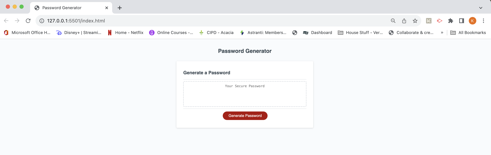
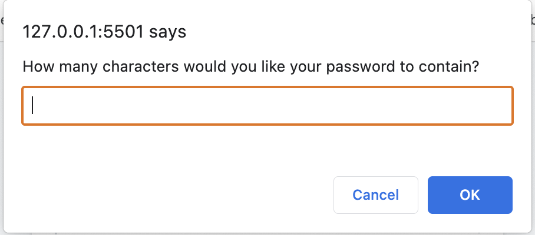

Prompts for when password length criteria is not met
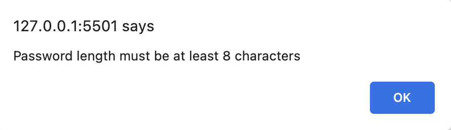
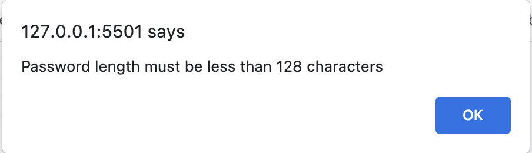
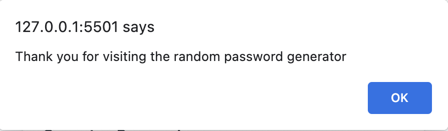

Prompts for when password length & character type criteria is met
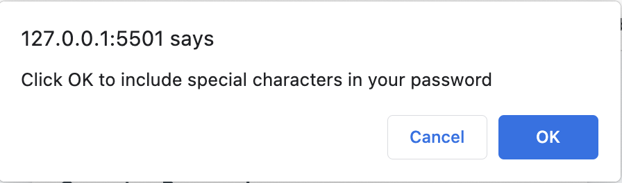
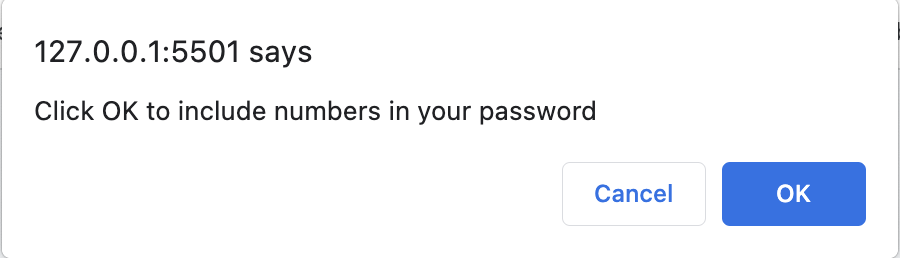
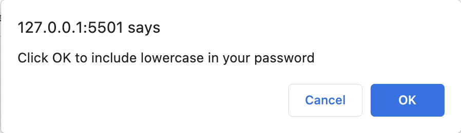
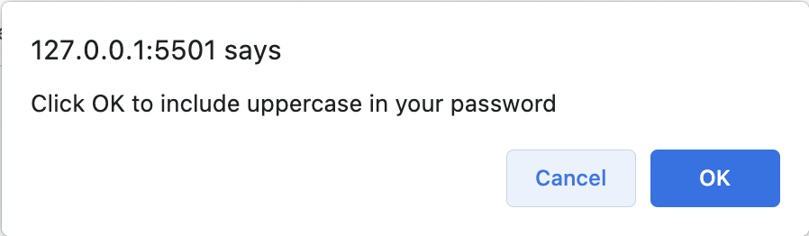
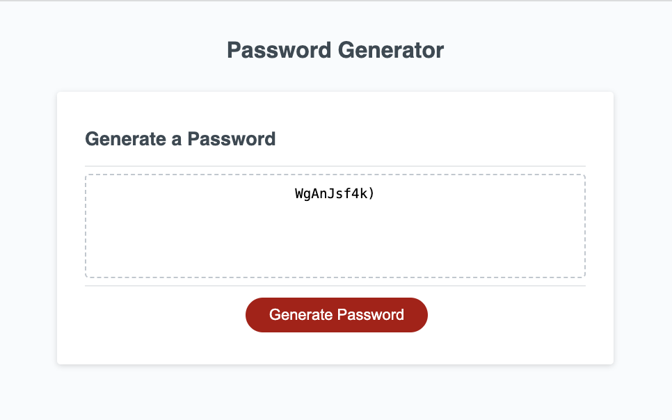

Prompt when character type criteria is not met 
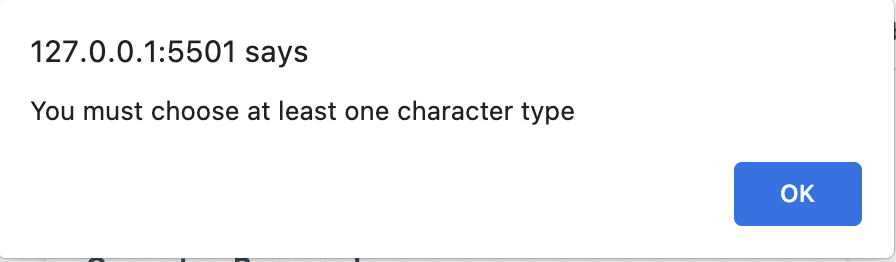

## Contributing

Pull requests are welcome. For major changes, please open an issue first
to discuss what you would like to change.

Please make sure to update tests as appropriate.

## License

[MIT](https://choosealicense.com/licenses/mit/)

